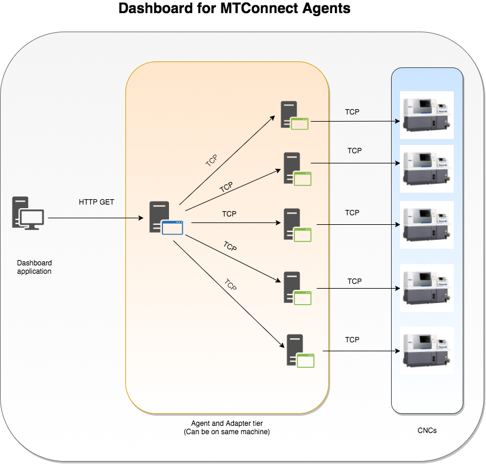

# MDataDashboard 

This application is a dashboard for MTConnect® stream Agent that connects with MTConnect® Adapter for Fanuc CNC machines. 



 Features
- servers number of machines served by agent.
- Dashboard shows few attributes such as name , id , partcount etc.
- Easy to use and maintain.


### Data Storage 
**MTConnect Agents by themselves are not storage applications.
This is made clear in the MTConnect Standard. Instead the purpose of MTConnect Agents is to serve data to client applications when requested. While the Agent does keep a small buffer, this buffer is not intended to be used for data storage but rather to retain data between connection interruptions. MDataDashboard fulfills the role of requesting this data and then reprsents the data in tabular form on browser. This application doesn't store the data from agent in any database as of now. 

### Installation

To install this dashboard you would need maven and java 1.8 installed on your machine. 

* Download the code from github 

    ``` git
    git clone https://github.com/vipubhale/mdata.git
    ```
* In case your agent is running on different machine modify the src/main/resources/config/application-prod.properties as below:
	```
    agent.endpoint=http://localhost:5020/current   #change localhost:5020 to domain or ip:port combination     
    ```
    If you are testing application on local using SOAP UI keep the properties file as it is
* Do the maven build
	``` maven
    mvn clean package
    ```
* This will create a zip file in the target directory of your workspace
	``` sh
    cp mdata-0.0.8-beta-distribution.zip
    unzip mdata-0.0.8-beta-distribution.zip
    ```
* Zip file contains 2 directories 
    * unix
    	* Inside this directory run run.sh
    	``` sh
        modata-0.0.8-beta/bin/run.sh 		
        ```
        *assuming after unzipping directory is not changed

    * windows
       * After unzipping copy the directory mdata-0.0.8 to C:/Program Files. So directory would be c:\Program Files\mdata-0.0.8-beta.
	   * Open command prompt(as administrator) and issue below commands:
          ``` bat
          cd c:\Program Files\mdata-0.0.8-beta\windows\
          mdata.exe install 
          ```
It will install the job as service. Once the service is started mdata.wrapper in the directory where its copied will give you logs for the process, mdata.out will have system out logs for java app, mdata.err will have system error logs for java app.

### Testing locally
If you want to evaluate this application. You can do the testing with SOAP UI as backend instead of agent.

* Install SOAP UI
* Import the project file from repository dashboard-soapui-project.xml
* Run the mock service 
	* Open/expand the project mdata-mock-agent in SOAP UI
	* Righclick on mock service mdata-mock-service and select 'start minimized'
	* Ensure in browswer http://localhost:5020/current gives an xml
* Run the application as per the Install section mentiond above.

Happy information driven manufacturing :+1: